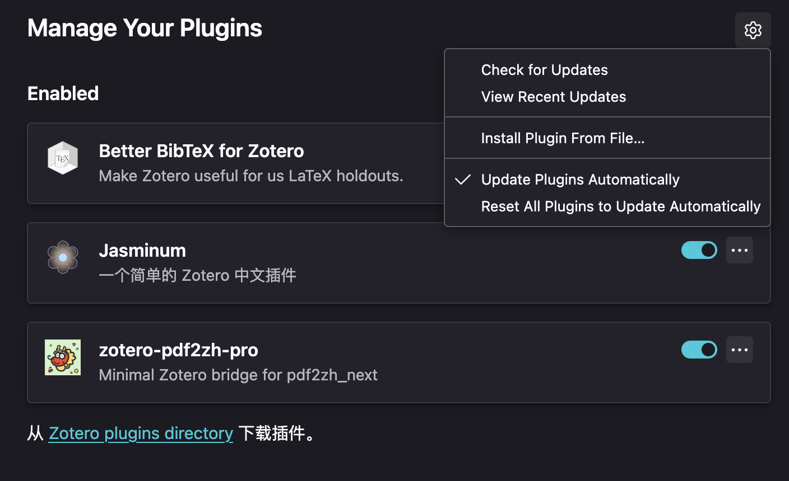
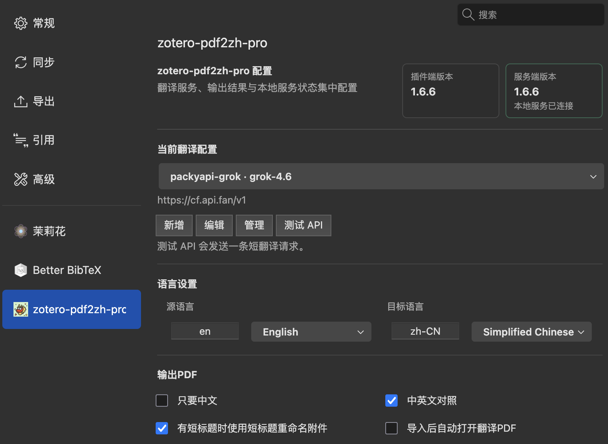
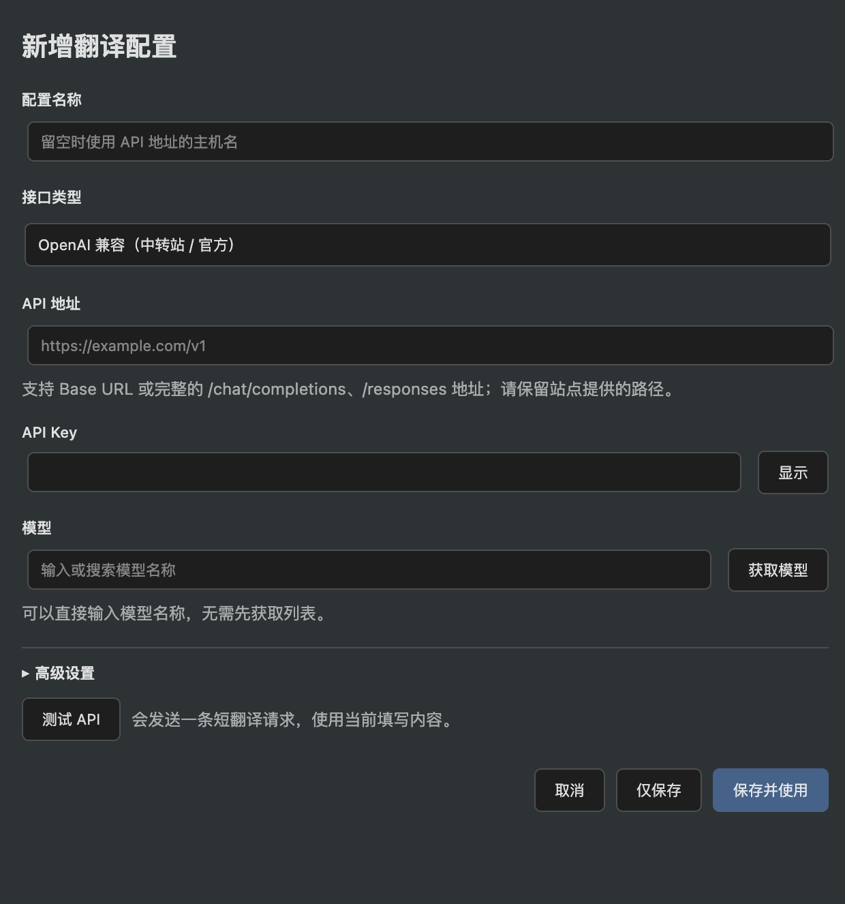

<div align="center">

# zotero-pdf2zh-pro

**让论文翻译更省心：在 Zotero 里发起任务，在本地完成翻译，再把结果自动带回来。**

面向 Zotero 8、9 和 10 的 PDF 翻译插件，配套本地 Python 服务调用
`pdf2zh_next`，兼顾易用安装、任务管理与可观测性。

[](https://github.com/study-233/zotero-pdf2zh-pro/releases/latest)
[](https://github.com/study-233/zotero-pdf2zh-pro/actions/workflows/ci.yml)
[](https://www.zotero.org/)
[](server/pyproject.toml)
[](https://pypi.org/project/zotero-pdf2zh-pro/)
[](LICENSE)

当前统一版本：<!-- release-version --> `1.6.7`

[Windows 安装](#windows) · [macOS 安装](#macos) · [配置翻译 API](#api-configuration) ·
[开始翻译](#usage) · [常见问题](#troubleshooting)

</div>

## 阅读导航

第一次使用，请依次完成 **安装本地服务 → 安装 Zotero 插件 → 配置翻译 API → 翻译一篇 PDF**。

| 你现在要做什么 | 阅读位置 |
| --- | --- |
| 了解需要准备什么 | [安装前准备](#quick-start) |
| 在 Windows 上安装 | [Windows 图文教程](#windows) |
| 在 Mac 上安装 | [macOS 终端教程](#macos) |
| 把 XPI 装进 Zotero | [安装插件与检查本地连接](#installation) |
| 填写中转站、API Key 和模型 | [配置翻译 API](#api-configuration) |
| 设置输出、提交任务、查看结果 | [第一次翻译](#usage) |
| 调整 OCR、参考文献、QPS 等 | [常用翻译参数](#translation-options) |
| 查看进度、处理失败、补译 | [任务管理](#task-management) |
| 更新、停止服务或卸载 | [更新与日常维护](#maintenance) |
| 安装失败或翻译出错 | [常见问题与排查](#troubleshooting) |

<a id="features"></a>

## 功能亮点

- **在 Zotero 内完成工作流**：右键提交 PDF，查看进度，完成后自动导入翻译附件。
- **多种输出**：生成译文 PDF、双语对照 PDF，也可以同时生成两种。
- **灵活配置 API**：支持 OpenAI 兼容接口、模型列表查询、Chat Completions 与 Responses。
- **任务可恢复**：查看失败原因，重试任务或只补译剩余段落。
- **请求指标**：查看 QPS、请求耗时、重试、token、本地缓存和服务端缓存。
- **版面与内容处理**：支持 OCR 相关选项、表格文字翻译和参考文献保护。

<a id="quick-start"></a>

## 1. 安装前准备

### 需要安装哪些东西？

| 组成部分 | 用途 | 获取方式 |
| --- | --- | --- |
| Zotero 8、9 或 10 | 管理论文和 PDF 附件 | [Zotero 官方下载](https://www.zotero.org/download/) |
| Zotero 插件（`.xpi`） | 在 Zotero 中提供翻译设置和任务入口 | [本项目最新 Release](https://github.com/study-233/zotero-pdf2zh-pro/releases/latest) |
| 本地 Python 服务 | 接收 PDF，运行翻译流程并保存结果 | Windows 用控制中心；macOS 推荐 Homebrew |
| 翻译 API 配置 | 指定提供翻译能力的接口和模型 | 从你使用的 API 服务商获取地址、API Key 和模型名 |

**插件和本地服务都需要安装。** 只安装 XPI 不会自动安装服务端；启动服务后，也仍需配置翻译 API。
Windows 控制中心会安装自己的 Python 环境，macOS Homebrew 会处理依赖，无需先手动配置系统 Python。

### 两种地址不要填反

| 地址 | 示例 | 填在哪里 |
| --- | --- | --- |
| 本地服务地址 | `http://127.0.0.1:8890` | 插件设置底部的“Python服务器地址” |
| 翻译 API 地址 | `https://api.example.com/v1`（占位示例） | “新增翻译配置”窗口中的“API 地址” |

工作流：`Zotero → 本地服务 → 翻译 API → 本地生成 PDF → 导入 Zotero`。

本地服务负责处理 PDF；使用云端 API 时，待翻译文本会发送给所选服务商，并按其规则消耗额度或计费。
API Key 与模型权限由服务商提供，安装本插件不会自动获得 API 额度。

> [!TIP]
> 第一次先用一篇篇幅较短、能够选中文字的 PDF 验证流程。默认已勾选“禁用术语提取”，建议保持：术语提取会额外消耗较多 token。

<a id="windows"></a>

## 2. Windows 安装教程

适用于 **Windows 10/11 x64**。首次安装需要联网下载运行环境和服务端。

### 第一步：下载并完整解压

1. 打开 [最新 Release](https://github.com/study-233/zotero-pdf2zh-pro/releases/latest)，展开发布页底部的 **Assets**。
2. 下载 `zotero-pdf2zh-pro-windows-x64.zip`，同时下载 `zotero-pdf2zh-pro.xpi`，稍后装入 Zotero。
3. 右键 ZIP，选择“全部解压”，进入解压后的文件夹。
4. 双击 `zotero-pdf2zh-pro.exe`。请保留 ZIP 内的配套文件，不要只复制 EXE，也不要直接在压缩包里运行。

### 第二步：选择安装位置并启动

1. 首次打开时，在“安装位置”处点击“选择”，按需指定目录；使用默认位置也可以。
2. 点击主按钮 **“安装并启动”**，等待窗口中的操作记录完成。
3. 控制中心会在所选产品目录安装私有 uv、uv 托管的 Python 3.13，以及与控制中心同版本的服务端。
4. 当状态变为 **“运行中”**、显示 **“翻译服务已就绪”**，且主按钮变为 **“停止服务”** 时，本地服务已启动。

默认产品目录为 `%LOCALAPPDATA%\zotero-pdf2zh-pro`。也可以像下图一样安装到其他磁盘；图中的目录只是示例。


*Windows 实机截图。版本号随安装版本变化；图中登录自启已关闭，首次安装默认会开启，可自行调整。*

### 第三步：保持服务运行并安装插件

服务地址保持 `http://127.0.0.1:8890`，接着完成[安装 Zotero 插件](#installation)。

- **关闭主窗口**只会隐藏到托盘；重新打开控制中心可继续查看状态。
- **退出控制中心**也不会停止已经运行的翻译服务。需要停止时，点击“停止服务”。
- **登录自启**开启后，登录 Windows 时控制中心静默进入托盘，并确保服务运行；升级不会重置你的选择。
- 安装不需要管理员权限，不创建 Windows Service、计划任务或防火墙规则，也不会停止占用 8890 端口的未知进程。

### 如果控制中心打不开

- 控制中心会自动检测 Microsoft Edge WebView2 Runtime。缺失时显示准备窗口，联网从微软下载、验证签名并安装，完成后自动继续启动；失败可重试、查看日志或打开[微软官方下载页面](https://developer.microsoft.com/microsoft-edge/webview2/)。首次准备需要联网，通常无需管理员权限。
- 如果旧版提示缺少 `WebView2Loader.dll`，请下载新版 Windows ZIP，完整解压后运行其中的 EXE，按界面安装或升级；无需先卸载原版，已有配置和翻译记录会保留。
- 当前 EXE 未签名，Windows SmartScreen 可能提示风险。请只从本项目 Release 下载，并核对发布页提供的 SHA-256。
- 图形界面仍无法使用时，可查看解压目录内的 [Windows 说明](scripts/windows/README.txt)，使用 `install.cmd`、`start-server.cmd` 或 `view-log.cmd` 等故障恢复入口。

<a id="macos"></a>

## 3. macOS 安装教程

推荐使用 **Homebrew 后台服务**，关闭终端后仍能运行。下面的命令在“应用程序 → 实用工具 → 终端”中执行，每段执行完成后再继续。

### 第一步：确认 Homebrew 可用

```bash
brew --version
```

能看到 Homebrew 版本号即可继续。如果提示 `command not found: brew`，请先按 [Homebrew 官方安装说明](https://brew.sh/)安装，并完成安装结束时提示的 **Next steps**，然后重新打开终端再检查。
Homebrew 会根据机器环境提示所需前置依赖；系统兼容性以官方说明为准。

### 第二步：安装本地服务

```bash
brew tap study-233/formula
brew install --build-from-source study-233/formula/zotero-pdf2zh-pro
```

首次安装会下载源码和依赖，耗时取决于网络和机器。等待命令结束、终端重新出现输入提示符，再继续启动服务。

### 第三步：启动并验证

```bash
brew services start zotero-pdf2zh-pro
brew services list
```

在列表中找到 `zotero-pdf2zh-pro`，检查状态是否为 `started`。再执行：

```bash
curl -fsS http://127.0.0.1:8890/health
```

正常情况下会返回 JSON，其中包含 `"status":"ok"` 和服务端 `version`。这表示本地服务可访问，**还不代表翻译 API 已配置成功**。
也可以在浏览器中打开 [本地健康检查](http://127.0.0.1:8890/health)。

上述 `brew services start` 在不使用 `sudo` 时会注册当前用户登录启动，终端可以关闭。具体行为见 [Homebrew services 文档](https://docs.brew.sh/Manpage#services-subcommand)。
现在继续[安装 Zotero 插件](#installation)。

### 日常启动、停止和查看日志

| 操作 | 命令 |
| --- | --- |
| 查看状态 | `brew services list` |
| 启动并启用登录启动 | `brew services start zotero-pdf2zh-pro` |
| 停止并取消登录启动 | `brew services stop zotero-pdf2zh-pro` |
| 重启服务 | `brew services restart zotero-pdf2zh-pro` |
| 查看最近日志 | `tail -n 100 "$(brew --prefix)/var/log/zotero-pdf2zh-pro.log"` |

翻译进行中请保持服务运行；重启或停止前先处理当前任务。

### 备用方式：使用 uv 手动运行

如果不使用 Homebrew 管理此服务，可按 [uv 官方安装说明](https://docs.astral.sh/uv/getting-started/installation/)准备 uv，然后执行：

```bash
uv tool install --python 3.13 zotero-pdf2zh-pro
uv tool update-shell
```

重新打开终端，再启动：

```bash
zotero-pdf2zh-pro
```

这是前台运行方式，**翻译时保持该终端打开**；按 `Ctrl+C` 停止。默认仍使用 `http://127.0.0.1:8890`，验证方法与 Homebrew 相同。
如果命令找不到，先确认已重新打开终端，并用 `uv tool list` 检查安装结果，参见 [uv 工具使用说明](https://docs.astral.sh/uv/guides/tools/)。

Homebrew 和 uv 选择一种运行方式即可。切换到 uv 前，先停止已有 Homebrew 服务，避免两份服务争用 8890 端口。

<a id="installation"></a>

## 4. 安装 Zotero 插件与检查连接

Windows 和 macOS 使用同一个 XPI 文件。

### 安装 XPI

1. 从 [最新 Release](https://github.com/study-233/zotero-pdf2zh-pro/releases/latest) 下载 `zotero-pdf2zh-pro.xpi`；不需要解压 XPI。
2. 打开 Zotero，进入 **“工具 → 插件”**（英文界面为 `Tools → Plugins`）。
3. 点击右上角齿轮按钮，选择 **“Install Plugin From File…”**。部分版本显示为 `Install Add-on From File…`，均为从文件安装插件。
4. 选择下载的 XPI，按提示完成安装并重启 Zotero。
5. 回到插件列表，确认 `zotero-pdf2zh-pro` 已启用。



*macOS 实机截图；Windows 使用相同的插件管理入口。*

### 打开设置并检查本地服务

1. Windows：进入 **“编辑 → 设置”**；macOS：进入 **“Zotero → 设置”**，也可按 `⌘,`。
2. 在左侧选择 **“zotero-pdf2zh-pro”**。
3. 找到下方“服务端连接”，确认 **“Python服务器地址”** 为 `http://127.0.0.1:8890`。
4. 点击 **“检查本地服务”**，确认检查结果，并查看上方是否显示服务端版本。



*macOS 设置页实机截图：插件端和服务端均为 1.6.6，本地服务已连接。图中的已有配置仅展示界面，不是服务商推荐；版本号以实际安装为准。*

如果提示“本地服务无法连接”，先回到 Windows 控制中心或 macOS 服务状态检查。修改 API Key 无法修复本地服务未启动的问题。

<a id="api-configuration"></a>

## 5. 配置翻译 API

### 新增第一个配置

在插件设置顶部点击 **“新增”**。使用支持 OpenAI 格式的官方接口或中转站时，接口类型选择 **“OpenAI 兼容（中转站 / 官方）”**。

| 字段 | 应该填写什么 | 占位示例 |
| --- | --- | --- |
| 配置名称 | 自己容易辨认的名称，留空会取 API 地址的主机名 | `论文翻译` |
| 接口类型 | 按服务商实际接口选择 | `OpenAI 兼容（中转站 / 官方）` |
| API 地址 | 服务商提供的 API Base URL 或完整端点 | `https://api.example.com/v1` |
| API Key | 该服务商签发的密钥；不要填网页登录密码 | 使用你自己的密钥 |
| 模型 | 服务商支持、且当前 Key 有权限调用的模型 ID | `your-model-id` |

**上表中的域名和模型是占位符，不能直接用于翻译。** 聊天网站的网址、账号套餐名称通常不是 API 地址或模型 ID，请以服务商 API 文档为准。



*新增翻译配置窗口实机截图。灰色文字是输入提示，并非已保存的配置；使用时需填入自己的 API 地址、API Key 和模型。*

1. 填写 API 地址和 API Key。
2. 点击 **“获取模型”**，输入关键词筛选，使用方向键和回车选择；也可以直接手填模型 ID。
3. 点击 **“测试 API”**。它会用窗口中当前填写的内容发送一条短翻译请求，可能消耗少量 API 额度。
4. 测试成功后点击 **“保存并使用”**，返回设置页，确认“当前翻译配置”显示所选名称和模型。

获取模型失败不一定代表不能翻译：有些服务商不提供模型列表接口。此时手填模型后测试即可。
“仅保存”不会切换当前配置；测试未保存的配置也不会改变正在使用的配置。

### API 地址怎么填？

以下均为地址结构示例，需替换成服务商提供的真实地址：

| 服务商给出的地址形式 | 填写方式 |
| --- | --- |
| Base URL：`https://api.example.com/v1` | 原样填写，包括 `/v1` |
| 带自定义前缀：`https://api.example.com/gateway/v1` | 保留整个前缀 |
| 完整 Chat Completions 地址：`https://api.example.com/v1/chat/completions` | 可原样填写 |
| 完整 Responses 地址：`https://api.example.com/v1/responses` | 可原样填写 |

插件**不会自动补 `/v1`**。不要根据示例擅自给服务商地址增加或删除路径，也不要把本地服务地址填到这里。

### 高级设置：协议和额外请求参数

首次配置建议保持 **“接口协议 → 自动识别”**。如果服务商明确要求某种协议，可展开“高级设置”，选择 Chat Completions 或 Responses。

- 如果填写的是完整端点，手动选择的协议须与 `/chat/completions` 或 `/responses` 后缀一致。
- 自动识别仅在明确不支持接口时尝试另一协议；鉴权、模型、参数、限流和超时错误会直接提示。任务开始后固定使用已确定的协议。
- 新配置默认自动识别；旧配置继续使用 Chat Completions。旧服务端无法使用 Responses 或额外请求参数时，请先升级服务端。
- Responses 目前支持同步、非流式文本翻译，各段独立请求且默认 `store=false`；仅提供流式响应或要求工具调用的接口不适用。

“额外请求参数（JSON）”留为 `{}` 即可。只有服务商要求时再填写，例如：

```json
{
  "max_output_tokens": 4096,
  "reasoning": { "effort": "low" }
}
```

此处只是参数格式示例，并非所有模型都支持这些字段。常用字段会随协议转换，中转站扩展字段直接透传；冲突参数会报错。
不能覆盖模型、翻译输入、执行方式、会话、工具或连接设置。“内部配置参数”用于兼容旧配置，新手保持不变即可。

### 管理多个配置

- “当前翻译配置”按 **“配置名称 · 模型”** 展示，选中后立即用于后续新任务，无需额外激活。
- 点击“管理”可新增、编辑、复制、删除或置顶；编辑其他配置不会切换当前选择。
- 删除当前配置后，需要重新选择一个配置，不会自动改用其他中转站。
- 同一批翻译固定使用提交时的配置，后续切换或编辑只影响新批次。
- 翻译缓存按 provider、模型、语言和提示词等配置隔离；修改协议或请求参数也会隔离缓存。

<details>
<summary>从旧版升级后，为什么显示“请选择配置”？</summary>

首次迁移会备份旧配置，并迁移原服务下唯一激活项。如果无法确定应使用哪项，会显示“请选择配置”，需要手动选择并测试。
有地址和模型的未知服务类型会转为 OpenAI 兼容并标记待测试。
旧配置备份保存在 Zotero 高级配置的 `extensions.zotero.pdf2zhpro.llmApisLegacyBackup`，其中包含原凭据，不要公开分享。

</details>

<a id="usage"></a>

## 6. 第一次翻译 PDF

### 设置语言与输出

回到插件设置，先确认“当前翻译配置”已经选好。

- 英文论文译成简体中文：源语言选择 `English`（`en`），目标语言选择 `Simplified Chinese`（`zh-CN`）。
- “输出PDF”默认勾选 **“中英文对照”**；需要译文版时勾选 **“只要中文”**，也可以两项同时勾选。至少保留一种输出。
- “导入后自动打开翻译PDF”默认关闭；需要完成后立即阅读时再开启。

输出选项的中文名称以英译中为例；实际译文语言由“目标语言”决定。

### 从文库提交任务

1. 在 Zotero 文库中找到论文，展开条目，确认存在 **本地 PDF 附件**；先双击原 PDF，确认能够打开。
2. 右键该 PDF 附件，展开 **“zotero-pdf2zh-pro”** 子菜单，选择 **“zotero-pdf2zh-pro: 翻译PDF”**。
3. 插件会打开任务列表并提交任务。可以查看当前阶段和总进度。
4. 等待任务完成，并确认导入状态为已导入；回到文库展开原条目，查看新生成的翻译附件。

英文界面的对应入口为 `zotero-pdf2zh-pro: Translate PDF` 和 `zotero-pdf2zh-pro: Task Manager`。

也可以右键论文父条目，由 Zotero 选择其最佳附件。**一篇论文有多个 PDF 时，直接选择要翻译的原 PDF 更明确**，避免选到补充材料或已经翻译的附件。
只有网页链接、尚未同步到本地的文件或非 PDF 附件无法直接翻译；先下载或附加原 PDF。

### 批量翻译与完成后检查

多选条目或 PDF 后使用同一翻译入口即可批量提交。第一次建议单篇验证，确认输出和 API 配置正确后再批量处理。

- 翻译期间保持本地服务运行；让 Zotero 保持打开，便于跟踪任务和及时导入附件。
- 不要只看进度是否达到 100%，还要看任务最终状态和“导入状态”。
- 任务完成但导入失败时，按下一节的“重试导入”处理；仍有段落失败时，使用“补译”。

<a id="translation-options"></a>

## 7. 常用翻译参数

在插件设置中展开 **“高级翻译参数”**。下表是代码中的初始默认值，已有配置不会因为阅读教程而自动重置。

| 设置 | 默认值 | 使用说明 |
| --- | --- | --- |
| 最大QPS | `10` | 限制每秒请求速率；遇到 429 或站点限流时降低 |
| 并发池大小 | `50` | 控制同时处理的并发规模；提高不一定更快，需匹配 API 限制 |
| 最后几页跳过翻译 | `0` | 需要保留文末附录等内容时，填写跳过页数 |
| 不翻译参考文献 | 关闭 | 开启后跳过识别到的参考文献区，输出 PDF 仍保留原文 |
| 翻译表格内文字 | 开启 | 表格中的文字也参与翻译 |
| 自动启用OCR workaround | 开启 | 允许翻译引擎按需启用 OCR 处理 |
| 强制启用OCR workaround | 关闭 | 针对扫描或文本识别异常的 PDF 排查时尝试，无需每篇都开启 |
| 禁用术语提取 | 开启 | 建议保持勾选，避免额外消耗大量 token |
| 跳过文本安全检查 | 关闭 | 通常保持默认，不作为通用的报错修复方式 |
| 字体族 | `auto` | 默认自动选择字体 |
| 禁用水印 | 开启 | 不添加翻译水印 |

如果不清楚服务商限额，可先将 **QPS 设为 2、并发池设为 4** 做单篇验证，再按实际限额调整。这是保守的起步建议，不是程序默认值，也不能保证所有站点都不会限流。

参考文献保护优先使用 PDF 版面标签，并在证据充分时结合 `References`、`Bibliography` 或 `参考文献` 标题识别；复杂排版仍建议人工核对。

<a id="task-management"></a>

## 8. 任务管理、请求指标与补译

右键文库条目，打开 **“zotero-pdf2zh-pro → zotero-pdf2zh-pro: 任务列表”**。


*macOS 上重新截取的已有任务记录。图中“远端任务 / 导入状态 无”表示当前插件未关联本地原条目，不能据此判断已导入；自己新提交的任务需另外检查导入状态。*

### 按任务状态选择操作

| 看到的状态或问题 | 应该做什么 |
| --- | --- |
| 排队中、运行中 | 等待阶段更新，查看服务和请求指标；避免重复提交 |
| 失败 | 先查看错误原因，修复连接或 API 问题后点击“重试任务” |
| 未完成，仍有应译段落失败 | 点击“补译”，保留已验证译文，只请求剩余段落 |
| 已完成，但导入失败 | 点击“重试导入”，重试拉取和导入已有结果，不重新翻译全文 |
| 已完成，但怀疑部分内容漏译 | 点击“检查并补译”，重新检查历史结果并补齐 |
| 不再需要保留的任务 | 核对结果已妥善保存后再用“删除记录” |

只要仍有应译段落失败，任务就会显示“未完成”，**不会自动导入 Zotero**。
补译默认使用 QPS 2、并发 4；修复输出采用新的附件文件名，保留旧附件。补译仍可能消耗 API 额度。

纯网址脚注会按规则保留，不调用翻译 API；含网址的正常正文仍会翻译。服务重启后可利用任务检查点继续补译。
“删除记录”会同时删除服务端对应任务的数据和恢复检查点，不只是隐藏列表中的一行。

### 看懂请求详情

点击任务卡片的 **“请求详情”**：


| 指标 | 含义 |
| --- | --- |
| 实际 QPS、活跃请求 | 最近的请求速率和正在进行的请求数量 |
| 平均耗时、P95 耗时 | 接口响应耗时；P95 用于观察较慢请求 |
| 剩余时间、段落吞吐量 | 依据当前处理情况估算，可能随阶段变化 |
| 本地缓存命中率 | 复用了本地已有翻译结果的情况 |
| 服务端缓存命中率 | 上游 API 返回的缓存使用统计，与本地翻译缓存不同 |
| Token（输入 / 输出） | 接口返回的输入与输出 token 用量 |
| 自动重试 | 临时错误导致的重试次数 |

通用 OpenAI 翻译器的 Chat Completions 与 Responses 共用指标面板。上游未返回的数据会显示 `-` 或不可用，部分缺失时标记不完整，**不能把缺失统计当作零消耗**。
连接、超时和临时服务错误最多尝试 5 次，重试也受公共限流和并发限制。

<a id="maintenance"></a>

## 9. 更新与日常维护

### 更新插件和服务端

插件与服务端分别更新，遇到协议或能力不兼容时检查两端版本。

| 安装方式 | 更新步骤 |
| --- | --- |
| Zotero 插件 | 在插件管理器中检查更新，或下载新 XPI 后从文件安装；按提示重启 Zotero |
| Windows 控制中心 | 启动时静默检查稳定版本；也可打开右下角“更多 → 检查更新”，发现新版后点击“更新到 vX.X.X” |
| macOS Homebrew | 按下方命令更新并重启服务 |
| uv | 停止前台服务，执行 `uv tool upgrade zotero-pdf2zh-pro`，再运行 `zotero-pdf2zh-pro` |

Homebrew 更新：

```bash
brew update
brew upgrade zotero-pdf2zh-pro
brew services restart zotero-pdf2zh-pro
curl -fsS http://127.0.0.1:8890/health
```

更新前先等待翻译完成。Windows 更新会下载、校验并升级控制中心和服务端，替换程序时会显示命令行进度，结束后自动关闭。
任务、结果、日志和自启选择会保留，更新失败会尝试恢复旧版。尚不具备自动更新能力的旧控制中心，需要先手动安装一次新版 Windows ZIP。
插件通过公开的 `update.json` 接收稳定版更新，源码可从对应版本标签获取。

### 数据位置与迁移

- **Windows**：控制中心点击“打开数据目录”或“打开日志”；所选产品目录中的 `data` 存任务数据，`logs` 存日志。私有运行时和缓存也在该产品目录，开始菜单、自启项和安装位置记录在 Windows 用户配置中。
- **更改 Windows 安装位置**：使用“安装位置 → 更改”。迁移会先停止服务、复制并验证任务数据与检查点，失败时恢复原安装；不要直接拖动正在使用的产品目录。
- **macOS / uv**：打开 `/health`，查看 `workspace.path` 获取当前实际数据目录；不要根据别人的用户名或版本号猜路径。Homebrew 日志使用上文的 `tail` 命令查看。
- 如需保留翻译结果和恢复能力，在卸载或手动迁移前备份实际数据目录；任务中包含原 PDF、译文及恢复信息。

### 卸载

- **Windows**：在“更多 → 卸载”或开始菜单进入卸载，默认保留任务数据和日志；只有确定不再需要时才选择彻底删除。
- **Homebrew**：先停止服务并备份所需数据，再执行 `brew uninstall zotero-pdf2zh-pro`。
- **uv**：停止前台服务并备份所需数据，再执行 `uv tool uninstall zotero-pdf2zh-pro`。
- **Zotero 插件**：在“工具 → 插件”中禁用或移除。移除插件与卸载本地服务是两件事，需要分别处理。

<a id="troubleshooting"></a>

## 10. 常见问题与排查

按顺序检查 **本地服务 → API 配置 → PDF 与任务状态**，通常能更快定位问题。

| 现象 | 检查与处理 |
| --- | --- |
| 插件装好了，但没有翻译入口 | 确认 Zotero 版本受支持、插件已启用并重启；在文库中的条目或 PDF 上右键，展开插件子菜单 |
| “本地服务无法连接” | Windows 看控制中心是否“运行中”；Mac 看 `brew services list`；核对 `http://127.0.0.1:8890`，访问 `/health` |
| `/health` 返回 `degraded` | 查看 `workspace` 中的写入状态和错误，检查数据目录权限与磁盘空间 |
| 浏览器打开服务根地址返回 404 | 健康检查路径是 `/health`；不要用首页是否存在判断服务是否启动 |
| 8890 端口已被占用 | 检查是否重复运行 Homebrew、uv 或其他服务；只停止自己确认的服务，不要直接结束未知进程 |
| Windows 控制中心无法打开 | 旧版缺少 DLL 时下载新版完整 ZIP；运行环境准备失败时点击“重试”或“查看日志”，诊断文件为产品目录下的 `logs/webview2-setup.log` |
| `command not found: brew` | 完成 Homebrew 安装后的 Next steps 并重新打开终端 |
| `command not found: zotero-pdf2zh-pro` | uv 用户执行 `uv tool update-shell` 后重开终端；Homebrew 用户先确认安装命令成功 |
| 本地检查成功，但 API 测试失败 | 本地服务和上游 API 是两条连接；检查 API 地址、Key、模型及协议 |
| API 返回 401 / 403 | 检查密钥是否属于该站点、是否有效，以及账号和模型权限；以服务商返回原因判断 |
| API 返回 404 或模型不存在 | 核对 Base URL、自定义前缀、是否需要 `/v1`、协议后缀及模型 ID；必要时手填模型 |
| “获取模型”失败 | 该站点可能不支持列表查询；直接输入模型 ID，再使用“测试 API”验证 |
| API 返回 429 | 查看服务商限额或额度信息，降低 QPS 和并发，等待限制解除后重试 |
| API 超时或连接错误 | 检查网络、代理和站点可用性，先用短请求测试；不要仅靠提高并发解决 |
| HTTPS 证书错误 | 服务端使用操作系统信任的证书；检查代理证书是否正确安装，不要关闭证书校验 |
| 找不到附件、文件不存在 | 展开条目并打开原 PDF，确认已下载到本地；有多个附件时直接选择目标 PDF |
| 扫描件或输出文字异常 | 确认原 PDF 能正常打开，检查 OCR 选项；用单篇测试调整后人工核对排版 |
| 任务显示“未完成” | 查看剩余段落和错误，解决接口问题后点击“补译”；不是反复导入已有结果 |
| 任务已完成但没有新附件 | 查看导入状态；导入失败用“重试导入”，原条目须仍存在；“远端任务 / 无”不代表已关联当前文库 |
| token 或缓存显示 `-` | 接口未返回相应统计，或历史记录不完整；不代表请求免费或没有消耗 |

### 反馈问题时提供什么？

请附上操作系统、Zotero 版本、插件与服务端版本、安装方式、复现步骤、完整报错，以及相关时段的日志片段。
可同时说明问题发生在“检查本地服务”“测试 API”“提交翻译”还是“导入结果”。

分享截图或日志前移除 API Key、认证头和私人文档内容；无需公开完整配置备份或整个任务数据目录。
反馈入口见[问题反馈](#community)。

<a id="advanced"></a>

## 进阶：其他部署方式与本机开发

### Linux / Docker

Linux 可参考上文 uv 方式。已有 Docker 环境时，在本仓库根目录（含 `compose.yaml`）执行：

```bash
docker compose up --build -d
```

服务默认使用 8890 端口，数据和缓存通过 Compose 中的卷映射保存。端口绑定范围以 `compose.yaml` 为准；仅本机使用时可将端口映射限定为 `127.0.0.1:8890:8890`。
Docker 不会自动继承宿主机的证书信任库，需要私有 CA 时应在容器中配置。
服务端接口与兼容性说明见 [server/README.md](server/README.md)。

### macOS 本机源码部署

已经通过 Homebrew 安装服务，并希望直接部署当前工作树时，可以运行：

```bash
./scripts/local-deploy.sh
```

脚本会检查运行中任务，构建插件和后端，备份现有安装，更新 Homebrew 服务并执行健康检查；
失败时自动恢复上一版。只检查和打包而不修改本机安装时使用：

```bash
./scripts/local-deploy.sh --check-only
```

该流程不会修改版本、提交代码或发布远端制品。正式发布仍使用 `scripts/release.sh`。

也可在 GitHub Actions 手动运行 `Build Windows release`，输入已提交的版本号和完整
40 位提交 SHA。工作流在 Windows runner 上执行 `scripts/release.sh <版本> --no-push`、
插件与服务测试、PowerShell 5.1 安装升级回滚及 Python 3.13 OCR 检查，完成后上传
XPI、Windows ZIP、Python 包、对应源码和 `checksums.json`。它只构建和验证，不推送
标签或发布渠道；确认全部通过后，以同一提交创建版本标签，运行 `Publish PyPI`，
再发布 GitHub Release 并更新 Homebrew 配方。日常 CI 不执行完整 Windows 发布构建。

## 🌱 项目来源

本仓库直接基于
[NightWatcher314/zotero-pdf2zh-next](https://github.com/NightWatcher314/zotero-pdf2zh-next)
的 `v5.3.0` 版本继续开发；该项目又基于
[guaguastandup/zotero-pdf2zh](https://github.com/guaguastandup/zotero-pdf2zh)
演化而来。感谢两位上游维护者及所有贡献者。

完整更新记录见 [CHANGELOG.md](CHANGELOG.md)。

<a id="community"></a>

## 💬 反馈与贡献

遇到问题或有新想法，欢迎使用仓库已经准备好的 Issue 模板：

- [报告问题](https://github.com/study-233/zotero-pdf2zh-pro/issues/new?template=%E9%97%AE%E9%A2%98%E5%8F%8D%E9%A6%88.md)
- [提出功能建议](https://github.com/study-233/zotero-pdf2zh-pro/issues/new?template=%E5%8A%9F%E8%83%BD%E5%BB%BA%E8%AE%AE.md)
- [查看现有 Issues](https://github.com/study-233/zotero-pdf2zh-pro/issues)

Pull Request 也很欢迎。较大的行为调整建议先创建 Issue，说明使用场景和预期结果，方便在
动手前对齐方向。

## 📄 License

本项目采用 `AGPL-3.0-or-later`，并保留所有上游项目和第三方组件的许可证与归属，
见 [LICENSE](LICENSE) 和
[server/THIRD_PARTY_NOTICES.md](server/THIRD_PARTY_NOTICES.md)。
