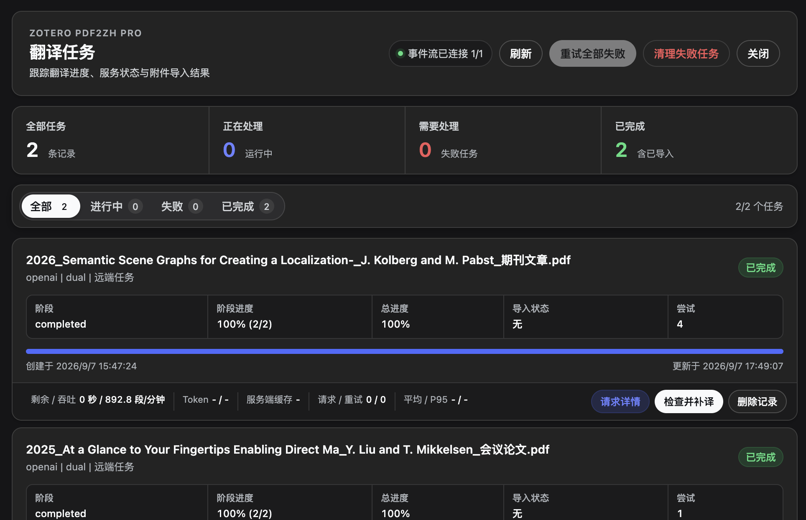
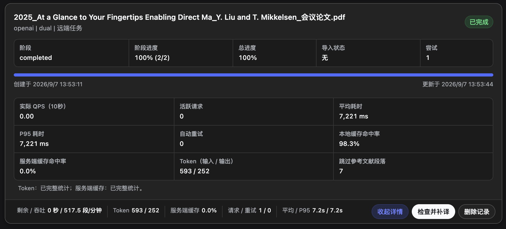
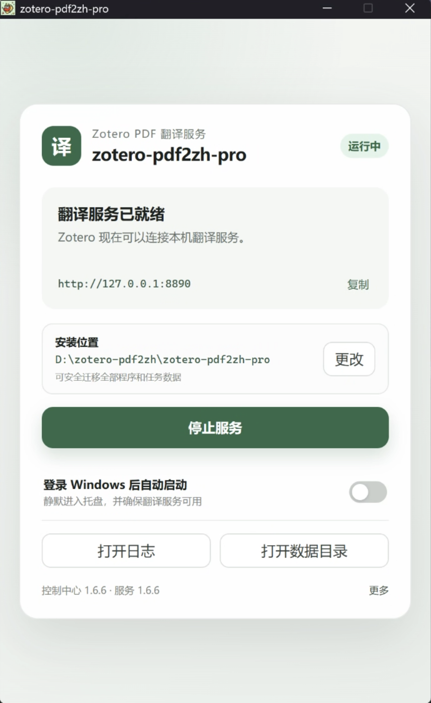

<div align="center">

# zotero-pdf2zh-pro

**让论文翻译更省心：在 Zotero 里发起任务，在本地完成翻译，再把结果自动带回来。**

面向 Zotero 8、9 和 10 的 PDF 翻译插件，配套本地 Python 服务调用
`pdf2zh_next`，兼顾易用安装、任务管理与可观测性。

[](https://github.com/study-233/zotero-pdf2zh-pro/releases/latest)
[](https://github.com/study-233/zotero-pdf2zh-pro/actions/workflows/ci.yml)
[](https://www.zotero.org/)
[](server/pyproject.toml)
[](https://pypi.org/project/zotero-pdf2zh-pro/)
[](LICENSE)

当前统一版本：<!-- release-version --> `1.5.0`

[快速开始](#quick-start) · [功能亮点](#features) · [安装方式](#installation) ·
[使用说明](#usage) · [问题反馈](#community)

</div>

> [!IMPORTANT]
> 术语提取会消耗大量token，暂时建议不开启

## 🖼️ 界面预览



<table>
  <tr>
    <td width="68%">
      
    </td>
    <td width="32%">
      
    </td>
  </tr>
  <tr>
    <td align="center">DeepSeek 请求、缓存、token 与费用指标</td>
    <td align="center">Windows 图形化控制中心</td>
  </tr>
</table>

<a id="features"></a>

## ✨ 功能亮点

|     | 能力              | 你会得到什么                                                         |
| --- | ----------------- | -------------------------------------------------------------------- |
| 🚀  | 多平台安装        | Windows 图形化控制中心、macOS Homebrew、uv 与 Docker                 |
| 📊  | 任务尽在掌握      | 查看阶段与总进度，失败后重试，并将翻译结果导回 Zotero                |
| 🔭  | DeepSeek 可观测性 | 查看请求耗时、QPS、缓存、重试、token、吞吐量、预计剩余时间和估算费用 |
| 🧠  | 配置隔离缓存      | 按 provider、模型、语言和提示词隔离缓存，避免错误复用译文            |
| 📚  | 参考文献保护      | 可选跳过参考文献翻译，同时在输出 PDF 中保留原文                      |
| 🛟  | 安全更新与回滚    | Windows 与 macOS 更新流程保护运行中任务，失败时恢复上一版本          |

工作流保持简单：`Zotero → 本地服务（127.0.0.1:8890）→ pdf2zh_next → 翻译 PDF → Zotero`。

<a id="quick-start"></a>

## ⚡ 快速开始

所有平台都需要安装 Zotero 插件，再选择一种本地服务运行方式：

| 你的环境           | 推荐方式                   | 服务端启动                              |
| ------------------ | -------------------------- | --------------------------------------- |
| Windows 10/11 x64  | Release 中的图形化控制中心 | 双击 EXE，点击“安装并启动”              |
| macOS              | Homebrew                   | `brew services start zotero-pdf2zh-pro` |
| macOS / Linux      | uv                         | `zotero-pdf2zh-pro`                     |
| 支持 Docker 的环境 | Docker Compose             | `docker compose up --build -d`          |

1. 从 [最新 Release](https://github.com/study-233/zotero-pdf2zh-pro/releases/latest)
   下载 `zotero-pdf2zh-pro.xpi`。
2. 在 Zotero 中进入 `工具 → 插件`，点击右上角齿轮，选择
   `Install Add-on From File...`，安装 XPI 并重启 Zotero。
3. 按下方说明启动本地服务，在插件设置中点击“检查连接与配置”。
4. 右键条目或 PDF 附件，选择 `zotero-pdf2zh-pro: Translate PDF`。

<a id="installation"></a>

## 📦 安装方式

### Zotero 插件

插件安装后会通过公开的 `update.json` 接收后续稳定版本更新。仓库和发行版均公开，
GitHub Release 同时提供 Zotero XPI、自动更新清单和 Windows 安装包；对应源码可从
版本标签直接获取。

### Windows 10/11 x64

1. 从 [最新 Release](https://github.com/study-233/zotero-pdf2zh-pro/releases/latest)
   下载并解压 `zotero-pdf2zh-pro-windows-x64.zip`。
2. 双击 `zotero-pdf2zh-pro.exe`，点击“安装并启动”。

控制中心会安装官方 uv、uv 托管的 Python 3.13，以及公开 PyPI 上与控制中心相同版本的
服务端；全程不需要打开 PowerShell 或 CMD。

**运行与更新**

- 首次安装默认开启当前账户登录自启。重新登录后不会弹窗，控制中心会驻留系统托盘并
  确保服务运行；可在主卡片随时关闭，后续升级不会重新开启。
- 关闭主窗口只会隐藏到托盘，退出控制中心也不会停止服务。
- 控制中心启动时会静默检查 GitHub 稳定版本；发现新版后点击“更新到 vX.X.X”即可
  自动下载、校验、更新控制中心和服务端并重启。
- 任务、翻译结果、日志和自启选择都会保留，更新失败时自动恢复旧版。首次获得自动更新
  能力仍需手动安装一次包含该功能的 Windows ZIP。
- 包内的 CMD/PowerShell 文件仅作为故障恢复入口。

**安全与数据位置**

- 安装不需要管理员权限，不创建计划任务、Windows Service 或防火墙规则，也不会停止
  占用 8890 端口的未知进程。
- 唯一允许的自启机制是当前用户可见、可关闭的登录启动项。
- 数据位于 `%LOCALAPPDATA%\zotero-pdf2zh-pro\data`，日志位于
  `%LOCALAPPDATA%\zotero-pdf2zh-pro\logs`。
- 控制中心依赖 Microsoft Edge WebView2 Runtime；Windows 10/11 缺失时会在创建窗口前
  提供微软官方下载入口。
- 本阶段 EXE 未签名，SmartScreen 可能提示风险。请只从官方 Release 下载，并核对发布页
  提供的 SHA-256。

### macOS

通过公开的 Homebrew tap 安装：

```bash
brew tap study-233/formula
brew install --build-from-source study-233/formula/zotero-pdf2zh-pro
brew services start zotero-pdf2zh-pro
```

也可以从公开 PyPI 使用 uv 安装服务端：

```bash
uv tool install --python 3.13 zotero-pdf2zh-pro
zotero-pdf2zh-pro
```

### Docker

```bash
docker compose up --build -d
```

默认服务地址为 `http://127.0.0.1:8890`。

<a id="usage"></a>

## 🧭 使用说明

1. 打开 Zotero 设置中的 `zotero-pdf2zh-pro`。
2. 确认服务地址为 `http://127.0.0.1:8890`。
3. 点击“检查连接与配置”。
4. 配置翻译服务、语言和输出格式。
5. 在条目或 PDF 附件上右键，选择 `zotero-pdf2zh-pro: Translate PDF`。
6. 在 `zotero-pdf2zh-pro: Task Manager` 查看进度、重试任务并导入结果。

DeepSeek 任务会显示段落吞吐量、预计剩余时间、本地缓存命中、实际 QPS、请求耗时、
自动重试、token 和估算费用。费用只用于本地估算，不替代服务商账单。

“不翻译参考文献”默认关闭。启用后会优先使用 PDF 版面标签，并在证据充分时通过
`References`、`Bibliography` 或 `参考文献` 标题识别参考文献区；跳过的内容仍会保留在
输出 PDF 中。

## 🔄 更新与本机开发

### 稳定版本更新

- **插件：** 由 Zotero 自动检查稳定版本，也可以从 GitHub Release 手动安装新 XPI。
- **Windows：** 控制中心启动时静默检查稳定版本，发现新版后点击“更新到 vX.X.X”。
- **uv：** `uv tool upgrade zotero-pdf2zh-pro`。
- **Homebrew：** `brew upgrade zotero-pdf2zh-pro` 后重启服务。

### macOS 本机源码部署

已经通过 Homebrew 安装服务，并希望直接部署当前工作树时，可以运行：

```bash
./scripts/local-deploy.sh
```

脚本会检查运行中任务，构建插件和后端，备份现有安装，更新 Homebrew 服务并执行健康检查；
失败时自动恢复上一版。只检查和打包而不修改本机安装时使用：

```bash
./scripts/local-deploy.sh --check-only
```

该流程不会修改版本、提交代码或发布远端制品。正式发布仍使用 `scripts/release.sh`。

## 🌱 项目来源

本仓库直接基于
[NightWatcher314/zotero-pdf2zh-next](https://github.com/NightWatcher314/zotero-pdf2zh-next)
的 `v5.3.0` 版本继续开发；该项目又基于
[guaguastandup/zotero-pdf2zh](https://github.com/guaguastandup/zotero-pdf2zh)
演化而来。感谢两位上游维护者及所有贡献者。

完整更新记录见 [CHANGELOG.md](CHANGELOG.md)。

<a id="community"></a>

## 💬 反馈与贡献

遇到问题或有新想法，欢迎使用仓库已经准备好的 Issue 模板：

- [报告问题](https://github.com/study-233/zotero-pdf2zh-pro/issues/new?template=%E9%97%AE%E9%A2%98%E5%8F%8D%E9%A6%88.md)
- [提出功能建议](https://github.com/study-233/zotero-pdf2zh-pro/issues/new?template=%E5%8A%9F%E8%83%BD%E5%BB%BA%E8%AE%AE.md)
- [查看现有 Issues](https://github.com/study-233/zotero-pdf2zh-pro/issues)

Pull Request 也很欢迎。较大的行为调整建议先创建 Issue，说明使用场景和预期结果，方便在
动手前对齐方向。

## 📄 License

本项目采用 `AGPL-3.0-or-later`，并保留所有上游项目和第三方组件的许可证与归属，
见 [LICENSE](LICENSE) 和
[server/THIRD_PARTY_NOTICES.md](server/THIRD_PARTY_NOTICES.md)。
