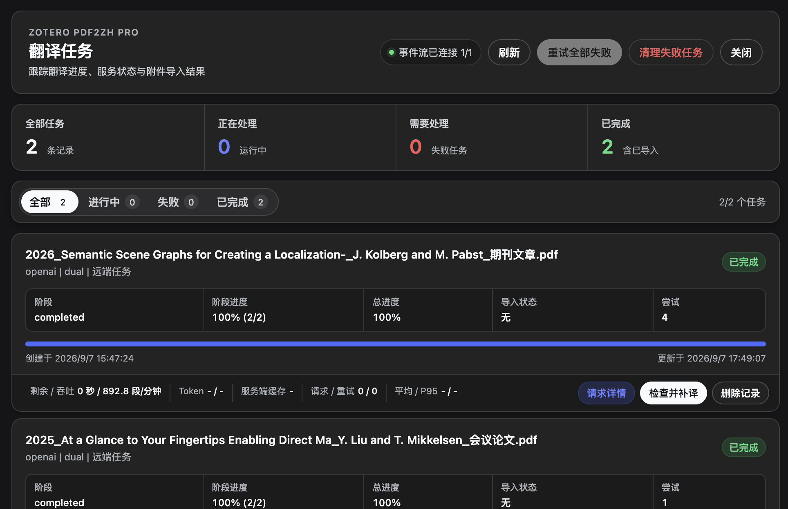

<div align="center">


# zotero-pdf2zh-pro

**在 Zotero 中翻译整篇论文，自动导入译文与双语 PDF。**

面向 Zotero 8、9 和 10，配套本地 Python 服务调用 `pdf2zh_next`，
从提交 PDF、查看进度到阅读译文，都在熟悉的文库中完成。

[](https://github.com/study-233/zotero-pdf2zh-pro/releases/latest)
[](https://github.com/study-233/zotero-pdf2zh-pro/actions/workflows/ci.yml)
[](https://www.zotero.org/)
[](server/pyproject.toml)
[](https://pypi.org/project/zotero-pdf2zh-pro/)
[](LICENSE)

当前统一版本：<!-- release-version --> `1.8.0`

[快速开始](#quick-start) · [使用指南](docs/user-guide.md) ·
[常见问题](#troubleshooting) · [更新记录](CHANGELOG.md)

</div>

<a id="features"></a>

## 功能亮点

- **融入 Zotero 文库**：右键提交单篇或批量 PDF，完成后自动导入翻译附件。
- **译文与双语输出**：可生成译文 PDF、双语对照 PDF，或同时保留两种版本。
- **灵活配置模型**：支持 OpenAI 兼容 API、模型列表查询、Chat Completions 与 Responses。
- **失败段落补译**：保留已验证译文，只请求剩余段落，修复结果新增附件并保留旧版批注。
- **划词精读**：划选后自动显示释义或译文，支持离线词典、必应或独立模型翻译、个人词典与按需语境解释，并复用精确匹配的已有译文；[使用说明](docs/user-guide.md#selection-translation)。
- **任务进度与请求指标**：查看阶段、QPS、耗时、重试、token 和缓存，支持导出诊断包。
- **按需调整翻译**：提供 OCR、表格翻译、参考文献保护与自定义附件标题。

## 界面预览



图中为历史远端任务，“导入状态：无”表示未关联当前文库条目；新任务请检查实际导入状态。

<a id="quick-start"></a>

## 快速开始

准备好 [Zotero 8、9 或 10](https://www.zotero.org/download/)，以及翻译服务商提供的 API 地址、Key 和模型名。
**本地服务与 Zotero 插件都需要安装。** Windows 控制中心和 macOS Homebrew 会处理 Python 环境。

### 1. 安装本地服务

<a id="windows"></a>

#### Windows 10/11 x64

1. 从 [最新 Release](https://github.com/study-233/zotero-pdf2zh-pro/releases/latest) 下载：
   - `zotero-pdf2zh-pro-windows-x64.zip`
   - `zotero-pdf2zh-pro.xpi`，留待下一步安装。
2. **完整解压 ZIP**，双击其中的 `zotero-pdf2zh-pro.exe`。
3. 选择安装位置，点击 **“安装并启动”**，等待显示 **“翻译服务已就绪”**。

首次安装需要联网。关闭控制中心窗口会隐藏到托盘；停止服务请使用“停止服务”按钮。

[Windows 图文教程与启动排查 →](docs/user-guide.md#windows)

<a id="macos"></a>

#### macOS

先安装 [Homebrew](https://brew.sh/)，在终端依次执行：

```bash
brew tap study-233/formula
brew install --build-from-source study-233/formula/zotero-pdf2zh-pro
brew services start zotero-pdf2zh-pro
```

检查本地服务：

```bash
curl -fsS http://127.0.0.1:8890/health
```

返回包含 `"status":"ok"` 的 JSON 即表示本地服务可访问。服务在后台运行，终端可以关闭。

[macOS 完整教程与日志查看 →](docs/user-guide.md#macos)

使用 Linux、Docker 或希望通过 uv 手动运行？查看[其他部署方式](#advanced)。

<a id="installation"></a>

### 2. 安装 Zotero 插件

1. 下载 [最新 Release](https://github.com/study-233/zotero-pdf2zh-pro/releases/latest) 中的 `zotero-pdf2zh-pro.xpi`，无需解压。
2. 打开 Zotero **“工具 → 插件”**，点击齿轮 → **“Install Plugin From File…”**，选择 XPI 并按提示重启。
3. 打开 Zotero 设置，进入 **“zotero-pdf2zh-pro”**，点击 **“检查本地服务”**。

Windows 从“编辑 → 设置”进入，macOS 从“Zotero → 设置”进入。
服务地址保持 `http://127.0.0.1:8890`。

[插件安装与连接检查图解 →](docs/user-guide.md#installation)

<a id="api-configuration"></a>

### 3. 配置翻译 API

在插件设置中点击 **“新增”**，选择 **“OpenAI 兼容（中转站 / 官方）”**，填写服务商提供的 API 地址、Key 和模型。
点击 **“测试 API”**，成功后选择 **“保存并使用”**。

| 地址 | 填写位置 | 示例 |
| --- | --- | --- |
| 本地服务地址 | Python服务器地址 | `http://127.0.0.1:8890` |
| 翻译 API 地址 | 新增翻译配置 → API 地址 | `https://api.example.com/v1`（占位示例） |

API 地址需保留服务商给出的完整路径，插件不会自动补 `/v1`。
“获取模型”失败时可手填模型 ID，再测试 API。

PDF 在本地处理；使用云端 API 时，待翻译文本会发送给所选服务商，并消耗其 API 额度。

[API 配置图解、多配置管理与协议设置 →](docs/user-guide.md#api-configuration)

<a id="usage"></a>

### 4. 翻译第一篇 PDF

1. 确认当前翻译配置、源语言和目标语言；默认输出为 **“中英文对照”**。
2. 在文库中右键一个已下载到本地的 PDF，选择 **“zotero-pdf2zh-pro → zotero-pdf2zh-pro: 翻译PDF”**。
3. 在任务列表查看进度。完成后确认导入状态，再回到原条目下阅读新附件。

首次建议使用一篇较短、能够选中文字的 PDF。批量翻译时，多选条目或 PDF 后使用同一入口。
翻译期间保持本地服务运行，并让 Zotero 保持打开以便及时导入结果。

[输出设置、批量翻译与自定义附件标题 →](docs/user-guide.md#usage)

## 详细文档

<a id="translation-options"></a>

### 翻译设置

- [常用参数：QPS、并发、OCR 与参考文献](docs/user-guide.md#translation-options)
- [术语包下载与使用](docs/glossary-downloads.md)

<a id="task-management"></a>

### 任务与结果

- [任务状态、失败重试、补译与导入](docs/user-guide.md#task-management)
- [请求耗时、token 与缓存指标](docs/user-guide.md#看懂请求详情)
- [卡顿排查与诊断导出](docs/user-guide.md#diagnostics)

<a id="maintenance"></a>

### 更新与维护

- [插件和服务端更新、数据迁移与卸载](docs/user-guide.md#maintenance)
- [完整更新记录](CHANGELOG.md)

<a id="advanced"></a>

### 其他部署与开发

- [uv 手动运行](docs/user-guide.md#uv) · [Linux / Docker](docs/user-guide.md#advanced)
- [服务端接口与兼容性](server/README.md)
- [开发、测试与发布](docs/development-notes.md)
- [README 维护规范](docs/readme-maintenance.md)

<a id="troubleshooting"></a>

## 常见问题

| 问题 | 处理方式 |
| --- | --- |
| 插件无法连接本地服务 | Windows 检查控制中心，macOS 检查 `brew services list`，再访问 `/health` |
| 本地服务正常，但 API 测试失败 | 核对服务商的 API 地址、Key、模型与协议；本地连接成功不代表 API 可用 |
| 任务已完成，却没有新附件 | 查看导入状态；导入失败时点击“重试导入”，不会重新翻译 |
| 任务显示“未完成” | 已生成的 PDF 会带状态标记导入；修复原因后“补译”剩余段落 |
| 请求指标显示 `-` | 上游未返回统计或历史记录不完整，不代表零消耗 |

[查看完整排查指南 →](docs/user-guide.md#troubleshooting)

## TODO

- [ ] 译文附件反查与独立精读配置
- [ ] 接入 Codex
- [ ] 接入墨墨背单词

<a id="community"></a>

## 反馈与贡献

- [报告问题](https://github.com/study-233/zotero-pdf2zh-pro/issues/new?template=%E9%97%AE%E9%A2%98%E5%8F%8D%E9%A6%88.md)
- [提出功能建议](https://github.com/study-233/zotero-pdf2zh-pro/issues/new?template=%E5%8A%9F%E8%83%BD%E5%BB%BA%E8%AE%AE.md)
- [查看现有 Issues](https://github.com/study-233/zotero-pdf2zh-pro/issues)

反馈时请提供操作系统、Zotero 版本、插件与服务端版本，以及复现步骤和报错。
卡顿或任务失败可附上[诊断包](docs/user-guide.md#diagnostics)；分享截图或日志前移除密钥和私人内容。

欢迎提交 PR。开发前请阅读[开发维护笔记](docs/development-notes.md)，文档改动请遵循[README 维护规范](docs/readme-maintenance.md)。
较大的行为调整建议先通过 Issue 讨论使用场景和预期结果。

## 项目来源

本项目基于 [NightWatcher314/zotero-pdf2zh-next](https://github.com/NightWatcher314/zotero-pdf2zh-next)
的 `v5.3.0` 继续开发，该项目源自 [guaguastandup/zotero-pdf2zh](https://github.com/guaguastandup/zotero-pdf2zh)。
感谢上游维护者及所有贡献者。

## License

本项目采用 **AGPL-3.0-or-later**，保留上游项目与第三方组件的许可证及归属。
详见 [LICENSE](LICENSE) 和 [第三方声明](server/THIRD_PARTY_NOTICES.md)。
